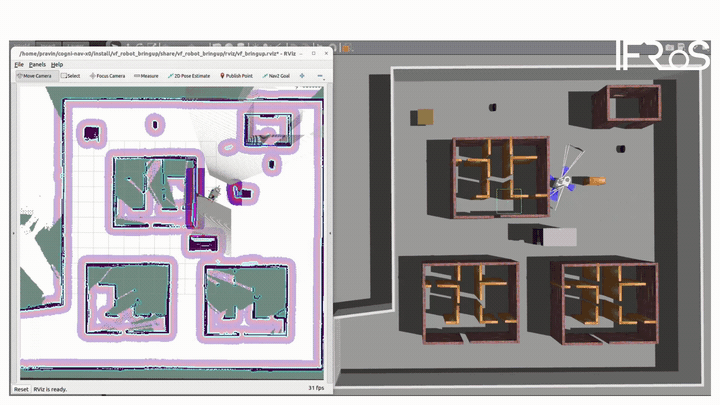
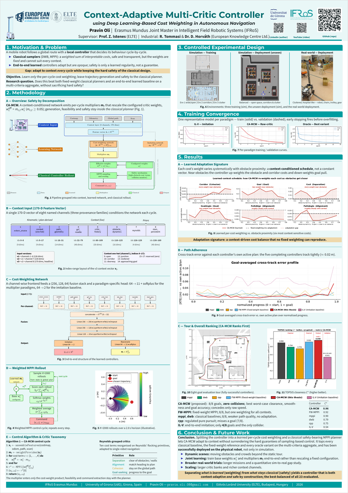
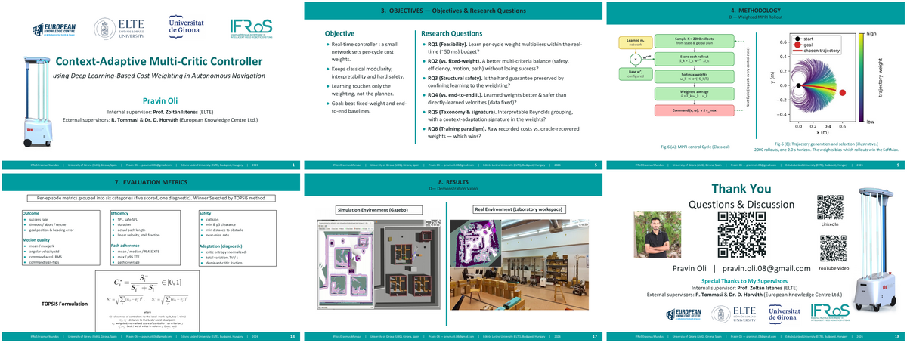

<div align="center">

# 🤖 CA-MCW — Context-Adaptive Multi-Critic Controller

### Deep Learning-Based Cost Weighting for Autonomous Navigation

*An adaptive MPPI controller that learns to re-weight interpretable navigation costs every
control cycle — adapting to context while keeping the hard safety guarantees of a classical planner.*

[](https://docs.ros.org/en/humble/)
[](https://releases.ubuntu.com/22.04/)
[](https://navigation.ros.org/)
[](https://classic.gazebosim.org/)
[](https://www.python.org/)
[](https://isocpp.org/)
[](LICENSE)

**Pravin Oli** · Erasmus Mundus Joint Master in Intelligent Field Robotic Systems (IFRoS) · UdG · ELTE
Supervisor: **Prof. Zoltán Istenes** (ELTE) · Industrial: **R. Tommasi** & **Dr. D. Horváth** (European Knowledge Centre Ltd.)

</div>

---

<div align="center">


<sub>CA-MCW navigating a real disinfection robot through a laboratory workspace — full autonomous goal tour.</sub>

</div>

---

## ✨ What is this?

A mobile robot follows a global route with a **local controller** that decides its behaviour cycle-by-cycle.

- **Classical samplers** (DWB, MPPI) optimise a *weighted sum of interpretable costs* — safe and
  transparent, but the weights are *fixed* and cannot suit every context.
- **End-to-end learned** controllers adapt, but are *opaque* — safety is only a learned regularity.

**CA-MCW** keeps the best of both. A small neural network emits per-cycle multipliers that rescale
the configured MPPI critic weights from live context, while **trajectory generation, feasibility,
and hard safety stay inside the classical planner**. The result is a controller that is *both*
context-adaptive *and* safe by construction.

> **Headline result.** Across 23 evaluated configurations, CA-MCW reaches **8/8 goals with zero
> collisions**, ranks **#1 by TOPSIS** multi-criteria scoring, and was **successfully deployed on
> the physical robot** — not only in simulation.

---

## 🎬 Demos

| Simulation (Gazebo) | Real-world UVC disinfection |
|:---:|:---:|
|  |  |
| Goal tour in the Gazebo evaluation world | Deployed on the ViroFighter UVC disinfection robot |

---

## 🧠 Highlights

- **Context-conditioned critic weighting** — a network rescales 11 MPPI critic weights every cycle
  from an 8-channel, up-to-170-dimensional context vector (kinematics, costmap, global path, scan,
  Reynolds priors, persistent SLAM features).
- **Safety by decomposition** — the learner only touches the *cost weighting*; generation and the
  collision/feasibility safety mechanism remain in the classical MPPI core.
- **Three learning paradigms compared** — raw-critic weighting (CA-MCW), oracle-recovered weights,
  and an end-to-end imitation (velocity-cloning) baseline.
- **Reproducible evaluation harness** — batch tour replay, TOPSIS ranking, cross-track-error
  profiles, and auto-generated METHODS/RESULTS prose and figures.
- **Sim-to-real** — the same controller runs unchanged from Gazebo to a real disinfection robot.

---

## 📦 Repository layout

| Package | Purpose | Docs |
|---|---|---|
| [`vf_robot_controller`](src/vf_robot_controller) | Custom Nav2 MPPI controller, GCF-aware critics, learned weight/velocity providers, training & inference | [README](src/vf_robot_controller/README.md) |
| [`vf_robot_bringup`](src/vf_robot_bringup) | Single launch entry point — merges Nav2 + localization + controller + RViz | [README](src/vf_robot_bringup/README.md) |
| [`vf_robot_utils`](src/vf_robot_utils) | Batch evaluation sweep, metrics, TOPSIS, figures, thesis prose | [README](src/vf_robot_utils/README.md) |
| [`vf_robot_gazebo`](src/vf_robot_gazebo) | Worlds, models, simulation launch | [README](src/vf_robot_gazebo/README.md) |
| [`vf_robot_slam`](src/vf_robot_slam) | RTAB-Map, depth-to-scan, scan merger | [README](src/vf_robot_slam/README.md) |
| [`vf_robot_description`](src/vf_robot_description) | URDF / xacro robot model, meshes | [README](src/vf_robot_description/README.md) |
| [`vf_robot_sensors`](src/vf_robot_sensors) | RealSense D435i / D455 sensor launches | [README](src/vf_robot_sensors/README.md) |
| [`vf_robot_messages`](src/vf_robot_messages) | Custom message types (`MppiCriticsStats`) | [README](src/vf_robot_messages/README.md) |

---

## 🛠️ Requirements

- **Ubuntu 22.04** + **ROS 2 Humble**
- **Nav2** (`ros-humble-navigation2`, `ros-humble-nav2-mppi-controller`)
- **Gazebo Classic 11**
- **RTAB-Map** (`ros-humble-rtabmap-ros`)
- Python 3.10, a Conda/venv with PyTorch + ONNX Runtime for offline training/inference

## ⚙️ Build

```bash
# clone into a colcon workspace (any name; ~/CA-MCW assumed in the docs)
cd ~/CA-MCW
rosdep install --from-paths src --ignore-src -r -y
colcon build --symlink-install
source install/setup.bash
```

`--symlink-install` means Python and YAML edits don't need a rebuild; C++ and launch-file changes do.

## 🚀 Quick start

Three terminals, in order.

```bash
# Terminal 1 — Gazebo (always first)
ros2 launch vf_robot_gazebo house_my1_world_xacro.launch.py
```

```bash
# Terminal 2 — bringup (pick a controller + localization mode)
ros2 launch vf_robot_bringup bringup_launch.py \
    controller:={mppi|dwb|rpp|graceful|vf_fixed|vf_collect|vf_inference|vf_passive} \
    localization:={amcl|slam_toolbox|rtabmap_slam|rtabmap_loc} \
    map_name:=house_my1_map  use_sim_time:=true  rviz:=true
```

```bash
# Terminal 3 — drive: click "Nav2 Goal" in RViz, or replay an evaluation tour
ros2 launch vf_robot_utils manual_evaluate.launch.py \
    map_name:=house_my1_map controller:=vf_inference \
    goal:=-3.535,-1.328,1.586 planners:=NavFn
```

Full argument tables live in each package README. The end-to-end
**train → deploy → evaluate** workflow is documented in
[`vf_robot_controller`](src/vf_robot_controller/README.md) and
[`vf_robot_utils`](src/vf_robot_utils/README.md).

> **🗺️ Maps note.** This repo ships the lightweight occupancy maps (`.pgm` + `.yaml`) and
> goal-pose tours (`.csv`) under [`maps/`](maps), which work with `amcl` / `slam_toolbox`.
> The large RTAB-Map `.db` databases (several GB each) are **not** hosted here — rebuild them on
> first run with `localization:=rtabmap_slam`, then switch to `rtabmap_loc`.

---

## 📊 Thesis, Poster & Presentation

<table>
<tr>
<td width="50%" valign="top">

### 📄 Thesis
Full MSc thesis (ELTE / IFRoS), with methodology, experiments and results.

➡️ **[Read the thesis (PDF)](thesis/pravin_elteikthesis_en.pdf)**

</td>
<td width="50%" valign="top">

### 🪧 Poster
Defense poster — pipeline, adaptation signature, and TOPSIS ranking at a glance.

➡️ **[Open the poster (PDF)](poster/poster.pdf)**

</td>
</tr>
</table>

<div align="center">
  <a href="poster/poster.pdf"></a>
</div>

### 🎞️ Defense presentation

➡️ **[Open the full slide deck (PDF)](presentation/presentation_Pravin-Oli.pdf)**

<div align="center">
  <a href="presentation/presentation_Pravin-Oli.pdf"></a>
</div>

---

## 📝 Citation

```bibtex
@mastersthesis{oli2026camcw,
  author  = {Pravin Oli},
  title   = {Context-Adaptive Multi-Critic Controller: Deep Learning-Based
             Cost Weighting in Autonomous Navigation},
  school  = {Eötvös Loránd University (ELTE) -- IFRoS Erasmus Mundus},
  year    = {2026}
}
```

## 🙏 Acknowledgements

Developed within the **IFRoS Erasmus Mundus Joint Master** (University of Girona · Eötvös Loránd
University) in collaboration with the **European Knowledge Centre Ltd.** Supervised by
Prof. Zoltán Istenes (ELTE); industrial supervision by R. Tommasi and Dr. D. Horváth.
Built on [Nav2](https://navigation.ros.org/), the Nav2 MPPI controller, and [RTAB-Map](http://introlab.github.io/rtabmap/).

## 📜 License

Released under the [Apache License 2.0](LICENSE). © 2026 Pravin Oli.
